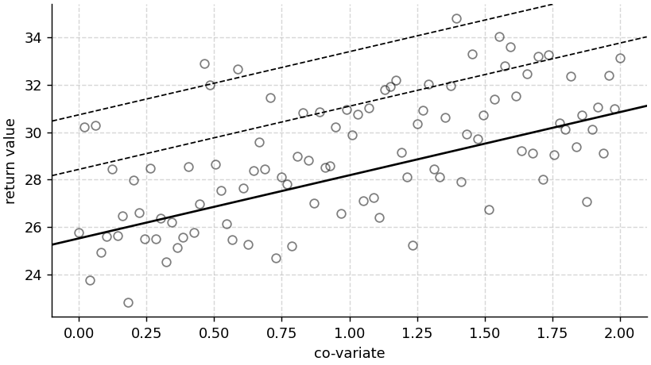

# wyextreme
A Python Package for GEV or GEV-shift fit

    python -m wyextreme.gev_shift test mu0=25 sigma=2 xi=-0.1 alpha=3

## notebook examples
* [2021 NW North American heat wave](https://nbviewer.jupyter.org/github/wy2136/wyextreme/blob/main/example/wyextreme_example.ipynb)
* [test a given distribution](https://nbviewer.jupyter.org/github/wy2136/wyextreme/blob/main/example/wyextreme_test.ipynb)
